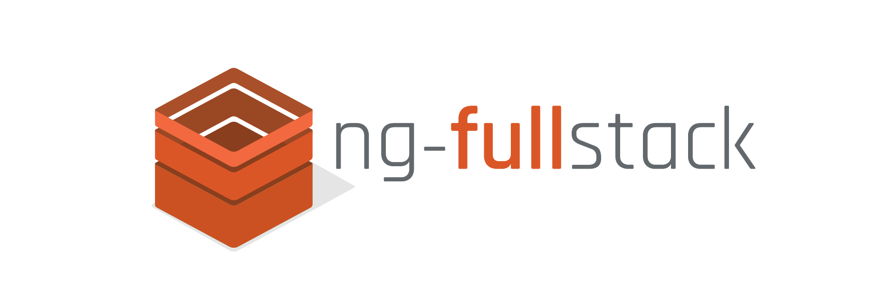

[](https://travis-ci.org/ericmdantas/generator-ng-fullstack)
[](https://coveralls.io/github/ericmdantas/generator-ng-fullstack?branch=master)
[](https://badge.fury.io/js/generator-ng-fullstack)
[](https://gitter.im/ericmdantas/generator-ng-fullstack?utm_source=badge&utm_medium=badge&utm_campaign=pr-badge)

### install

```shell
$ npm install -g generator-ng-fullstack
```

### what is this?

This is a [Yeoman](http://yeoman.io) generator for the now and next generation fullstack applications.

Forget about initial setup, ```yo ng-fullstack``` and be happy!


### quick start

[Take a look here](https://github.com/ericmdantas/generator-ng-fullstack/wiki#do-i-need-anything).

### what am I going to be using?

You'll be using the **latest** versions of:

- [Node](https://github.com/nodejs/node) / [Go](https://golang.org/);
- [AngularJS](https://github.com/angular/angular.js) / [Angular2](https://github.com/angular/angular);
- [Babel](https://github.com/babel/babel) / [Typescript](https://github.com/Microsoft/Typescript);
- [Bootstrap](https://github.com/twbs/bootstrap);
- [Gulp](https://github.com/gulpjs/gulp);
- [Express](https://github.com/strongloop/express);
- [MongoDB](https://github.com/mongodb/mongo) + [Mongoose](https://github.com/learnboost/mongoose) / [mgo](https://github.com/go-mgo/mgo);
- [Bluebird](https://github.com/petkaantonov/bluebird);
- [Lodash](https://github.com/lodash/lodash);
- [Integration with Heroku](https://www.heroku.com/);
- [Integration with New Relic](http://newrelic.com/);
- [Integration with MongoHQ](https://www.compose.io/);
- [Integration with Google Analytics](http://www.google.com/analytics/);
- And a bunch of great other modules out there!


### why did you create this?

Most solutions out there are either outdated or not as complete.

The idea is to keep this one going strong and updated.


### meh, I'm not interested. What else is out there?

This project is one of many things that you can use to get started building a new app.  
For a detailed comparison of the options and trade-offs between them, please visit [this](http://www.dancancro.com/comparison-of-angularjs-application-starters) link.


### inspiration

Inspired by [generator-angular-fullstack](https://github.com/DaftMonk/generator-angular-fullstack).


### got any idea?

PRs are welcome! Either commit them or let me know and we'll talk about it =]

### license

MIT
